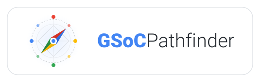
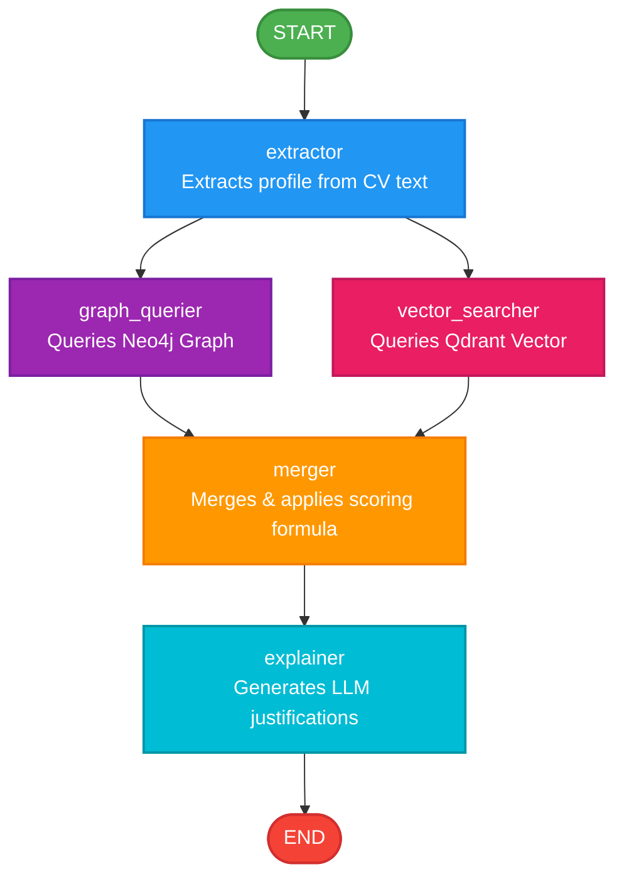
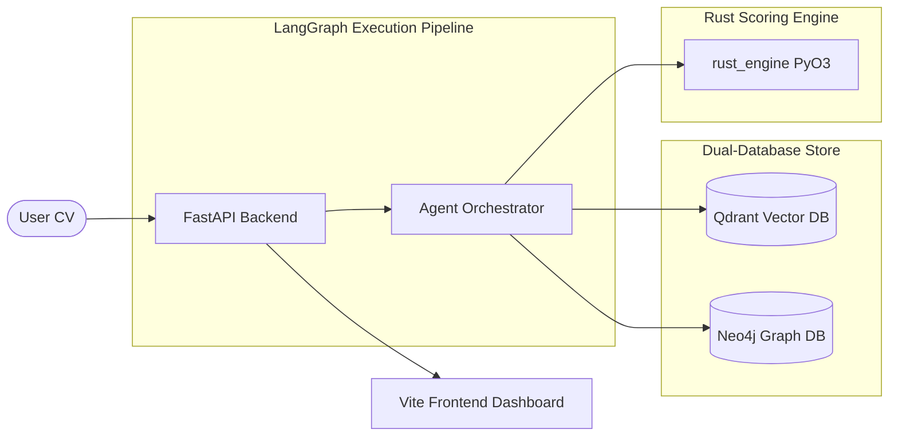

<p align="center">
  
</p>

<p align="center">
  <b>AI Agent organization matcher for Google Summer of Code (GSoC).</b>
</p>

<p align="center">
  <a href="https://github.com/KarimmYasser/GSoCPathfinder/actions/workflows/ci.yml">
    
  </a>
  <a href="LICENSE">
    
  </a>
  <a href="https://www.python.org/downloads/">
    
  </a>
  <a href="CONTRIBUTING.md">
    
  </a>
</p>

GSoC Pathfinder is an AI Agent organization matcher for Google Summer of Code (GSoC). By leveraging a high-performance Rust scoring engine, a Neo4j knowledge graph, a Qdrant semantic vector database, and LangGraph-based agentic workflows, it maps out the GSoC ecosystem to match candidate profiles to the most suitable organizations, analyze skill gaps, draft proposals, and visualize connections in real-time.

---

## 📖 Table of Contents

- [🚀 Key Features](#-key-features)
- [🧠 Architecture](#-architecture)
  - [LangGraph Agent Workflow](#langgraph-agent-workflow)
  - [System Components & Databases](#system-components--databases)
- [🛠️ Tech Stack](#️-tech-stack)
- [💾 Database Schemas](#-database-schemas)
  - [Neo4j Graph Schema](#1-neo4j-graph-schema)
  - [Qdrant Vector Payload](#2-qdrant-vector-payload)
- [📡 API Specifications](#-api-specifications)
- [⚙️ Configuration & Environment Variables](#️-configuration--environment-variables)
- [🚦 Quick Start](#-quick-start)
- [🤝 Contributing](#-contributing)
- [🛡️ Security](#️-security)
- [⚖️ Code of Conduct](#️-code-of-conduct)
- [📄 License](#-license)

---

## 🚀 Key Features

* **Ingest & Normalize:** Parses 11 years of historical GSoC data (2016–2026), cleaning HTML and canonicalizing 663 organizations and 12,000+ projects using YAML synonym maps.
* **Dual-Database Knowledge Retrieval:**
  * **Neo4j Graph Database:** Captures temporal organization profiles, category groupings, and technology relationships.
  * **Qdrant Vector Store:** Indexes project descriptions using semantic embeddings for advanced semantic matching.
* **High-Performance Rust Scoring Engine:** Offloads heavy mathematical calculations to a core Rust module bound to Python via **PyO3/Maturin** for fast parallel calculations.
* **7-Factor Ranking System:** Ranks organizations based on:
  1. Skill Overlap (25%)
  2. Semantic Similarity (15%)
  3. Recency & Frequency (15%)
  4. Topic Alignment (10%)
  5. Project Volume (10%)
  6. Org Stability (10%)
  7. LLM Relevance (15%)
* **Interactive UI Dashboard (Google Material Design):**
  * **Responsive Grid:** Sleek dashboard with animations and curated Google theme elevations.
  * **Knowledge Graph Visualizer:** Fully interactive 2D force-directed graph featuring hover-active highlights, connection flows, smart label visibility, and zoom controls.
  * **CV Learning Roadmap Optimizer:** Generates a custom gap analysis and learning roadmap of exactly what skills to learn for any target organization.
  * **Proposal Draft Generator:** Drafts customized GSoC proposals tailored to your CV and the organization's past projects.
  * **Match Chat Assistant:** A draggable, resizable, and minimizable chat widget rendering native Markdown to discuss matched organizations in real-time.
  * **GitHub Good First Issues:** Fetches recruiting organization repositories and actively pulls beginner-friendly issues.

---

## 🧠 Architecture

### LangGraph Agent Workflow

The matching engine runs on a structured **LangGraph** execution pipeline:



1. **`extractor`**: Extracts structured profile data (programming languages, frameworks, interests) from the user's raw CV text using LLM function calling.
2. **`graph_querier`**: Queries Neo4j for organizations matching extracted technologies and topics.
3. **`vector_searcher`**: Embeds the CV text and queries Qdrant for semantically relevant historical GSoC projects.
4. **`merger`**: Combines vector and graph records, executing scoring functions (including the Rust Jaccard module) to compute rank scores.
5. **`explainer`**: Uses the LLM to generate narrative matching explanations for the top matched organizations.

### System Components & Databases



#### Rust Scoring Engine (`rust_engine`)
The weighted Jaccard similarity score (Factor 1: Skill Overlap) is compiled to binary machine code in Rust for performance:
* **F1 Algorithm:** Computes Jaccard index based on the intersection and union of CV skills and organization technologies.
* **CV Frequency Weighting:** Searches the raw CV text for each matching skill. Skills that appear more frequently in the user's CV carry higher weights during the Jaccard intersection calculation to favor core strengths.

---

## 🛠️ Tech Stack

- **Backend:** Python 3.12+, FastAPI, Uvicorn, Pydantic, LangGraph, LangChain
- **Frontend:** React, Vite, Tailwind CSS, Material Design UI, React Force Graph 2D
- **Databases:** Neo4j (Graph Database), Qdrant (Vector Database)
- **Tooling:** [uv](https://docs.astral.sh/uv/) (Dependency & Environment Management)
- **Scoring Engine:** Rust (compiled with Maturin & PyO3 bindings)

---

## 💾 Database Schemas

### 1. Neo4j Graph Schema
Neo4j models the GSoC network across years with the following nodes and relationships:
* **Nodes:**
  - `(o:Organization)` - Canonical GSoC organization details.
  - `(p:Project)` - Historical accepted GSoC projects.
  - `(t:Technology)` - Programming languages, libraries, and frameworks.
  - `(tp:Topic)` - Domain categories (e.g., machine learning, security, web).
  - `(y:YearProfile)` - An organization's specific participation profile for a single GSoC year.
* **Relationships:**
  - `(o)-[:HAS_PROFILE]->(y)`
  - `(y)-[:USES]->(t)`
  - `(y)-[:FOCUSES_ON]->(tp)`
  - `(y)-[:ACCEPTED_PROJECT]->(p)`

### 2. Qdrant Vector Payload
The `gsoc_projects` collection indexes historical projects. Each vector has the following metadata payload:
```json
{
  "project_title": "string",
  "project_description": "string",
  "org_canonical_name": "string",
  "year": 2024,
  "technologies": ["string"],
  "topics": ["string"]
}
```

---

## 📡 API Specifications

The FastAPI backend exposes the following endpoints:

| Endpoint | Method | Payload | Description |
|---|---|---|---|
| `/api/match` | `POST` | `{ "cv_text": "..." }` | Matches user CV with GSoC organizations, returning scores and explanations. |
| `/api/chat` | `POST` | `{ "messages": [...], "context": [...] }` | Conversational assistant tailored to the matched organizations. |
| `/api/proposal` | `POST` | `{ "cv_text": "...", "org_name": "...", "org_desc": "..." }` | Drafts a custom GSoC project proposal. |
| `/api/optimize_cv` | `POST` | `{ "cv_text": "...", "org_name": "...", "org_desc": "..." }` | Generates a custom gap analysis and learning roadmap. |
| `/api/graph_data` | `POST` | `{ "skills": [...], "org_names": [...] }` | Returns a JSON graph structure matching skills and orgs for 2D visualization. |
| `/api/issues` | `POST` | `{ "url": "..." }` | Fetches beginner-friendly "Good First Issues" from GitHub. |

---

## ⚙️ Configuration & Environment Variables

Configure the following variables in your `.env` file:

| Variable | Description | Default / Recommended |
|---|---|---|
| `LLM_PROVIDER` | LLM service type (`local` or `remote`) | `local` |
| `LLM_BASE_URL` | Base API URL for LLM provider (Ollama, LM Studio, OpenAI) | `http://localhost:1234/v1` |
| `LLM_API_KEY` | API Key for LLM service | `lm-studio` |
| `LLM_CHAT_MODEL` | Chat Model ID to use | `your-chat-model-name` |
| `EMBED_BASE_URL` | Base API URL of embedding provider | `http://localhost:1234/v1` |
| `EMBED_API_KEY` | API Key for embedding service | `lm-studio` |
| `EMBED_MODEL` | Embedding Model ID to use | `your-embed-model-name` |
| `EMBED_DIMENSION` | Dimensions size of embedding model (e.g. 768) | `768` |
| `NEO4J_URI` | Neo4j Bolt connection URI | `bolt://localhost:7687` |
| `NEO4J_USER` | Neo4j username | `neo4j` |
| `NEO4J_PASSWORD` | Neo4j password | `pathfinder123` |
| `QDRANT_HOST` | Qdrant host | `localhost` |
| `QDRANT_PORT` | Qdrant HTTP port | `6333` |
| `QDRANT_GRPC_PORT` | Qdrant gRPC port | `6334` |
| `DATA_DIR` | Local historical data folder path | `./Data` |
| `TOP_N_RESULTS` | Number of matched organizations to return | `10` |
| `EMBED_BATCH_SIZE` | Batch size for vector ingestion | `32` |

---

## 🚦 Quick Start

### Prerequisites
- **Python 3.12+**
- **Node.js 18+**
- **Docker & Docker Compose**
- **[uv](https://docs.astral.sh/uv/)** (Python environment manager)
- **Rust toolchain** (to build the scoring engine)
- **LM Studio** / **Ollama** or an **OpenAI API Key**

### 1. Database Setup
Start the Neo4j and Qdrant database containers:
```bash
docker compose up -d
```

### 2. Environment Setup
Copy the environment template and fill in your LLM API parameters:
```bash
cp .env.example .env
```

### 3. Dependency Sync & Rust Build
Sync workspace dependencies and compile the Rust scoring library in-place:
```bash
uv sync --all-extras
```

### 4. Ingest Historical Data
Ingest the historical GSoC data files:
```bash
uv run python scripts/ingest.py
```

### 5. Run the Backend API Server
Launch the FastAPI development server:
```bash
uv run uvicorn src.api.server:app --reload --port 8000
```

### 6. Run the Frontend Dashboard
Install frontend packages and start the Vite dev server:
```bash
cd frontend
npm install
npm run dev
```

Visit the dashboard in your browser at `http://localhost:5173`.

---

## 🤝 Contributing

Contributions are welcome! Please see [CONTRIBUTING.md](CONTRIBUTING.md) for local setup instructions, coding guidelines, and pull request workflows.

## 🛡️ Security

If you discover any security-related issues, please refer to [SECURITY.md](SECURITY.md) for contact and reporting instructions.

## ⚖️ Code of Conduct

We are committed to providing a friendly, safe, and welcoming environment. Please read our [Code of Conduct](CODE_OF_CONDUCT.md) before interacting with the project.

## 📄 License

This project is licensed under the MIT License - see the [LICENSE](LICENSE) file for details.
